# Project Path

**Ideas Meeting Audience**


## Curriculum

The Social Platform for Architectural Inspiration and Collaboration

## Purpose of the Project

Project Path is a Full-Stack web application designed to help users showcase and share their portfolio projects. It provides an intuitive platform where users can create, organize, and manage their projects, leveraging a React frontend for an engaging user experience and a REST API backend for reliable functionality. The application enables seamless project sharing, collaboration, and visibility for personal and professional growth.

## UX Design and Visual Decisions

### Visual Design Choices
The following design decisions were made to ensure a clean, modern, and architectural aesthetic for the user interface of the project:

#### **Fonts**
- **Logo Font**: *Poppins* – Geometric and contemporary style, adding a modern touch while maintaining legibility.
- **Primary Font**: *Source Sans 3* – Clean and neutral look, ideal for body text and content-heavy sections.
- **Button Font**: *Work Sans* – Readable and geometric, maintaining a modern and clean appearance.
- **Navigation Font**: *Quicksand* – Friendly yet contemporary feel, maintaining legibility in the navigation menu.

#### **Colors**
The color palette was chosen to give a minimalist and architectural feel with subtle contrasts:

- **Background Color**: #FFFFFF (White) – Clean and minimal.
- **Text Color**: #000000 (Black) – High contrast for readability.

#### **Button Colors**
- **General Button**: Default **#333** (Dark Grey), Hover **#4A7F7F** (Soft Teal), Active **#D57F32** (Muted Copper).
- **Follow Button**: Default **#4A7F7F** (Soft Teal), Hover **#ddd** (Light Grey).
- **Action Button**: Default **#D57F32** (Muted Copper), Hover **#dddddd** (Light Grey).
- **Delete Button**: Default **#7A5C5A** (Muted Burgundy), Hover **#dddddd** (Light Grey).

#### **Button Styles**
Simple, rounded buttons with neutral or accent colors for various actions, providing clear feedback on hover and active states.

#### **Additional Design Elements**
- **Box Shadows**: Subtle shadows are applied to containers, and the navbar to create depth. The navbar has a heavier shadow to stand out.
- **Rounded Corners**: Small 2px rounded corners are used for containers and form elements to maintain a modern and clean look.
- **Navbar Highlighting**: The active navbar item is highlighted with **#D57F32** (Muted Copper) to indicate the selected section.
- **Container Background**: Containers and the navbar have a soft background color of **#f8f8f8**, contributing to a light and minimal aesthetic.

### Wireframes
Wireframes were created to ensure the user interface is intuitive, clean, and architecturally cohesive. The wireframes outline the layout and visual hierarchy of key pages such as the Dashboard and Login pages.

!!! FILL IMAGES
#### **Key Wireframe Screens**
- **Dashboard**: Displays key navigation items, actions, and user profile.
- **Login Page**: Simple form layout with essential input fields for authentication.

## Project Management - Kanban Board

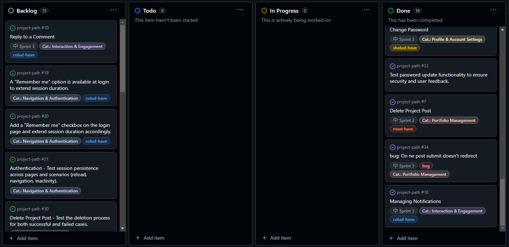
*[Project Path - Kanban Board](https://github.com/users/houndhunger/projects/4)*

For efficient project management, a **Kanban Board** is used to track progress, manage tasks, and ensure the project stays on schedule.

The Kanban board includes the following columns:
- **Backlog**: Tasks that are yet to be planned or prioritized.
- **To Do**: Tasks that are planned but not yet started.
- **In Progress**: Tasks currently being worked on.
- **Done**: Completed tasks.

### Category Labels

- **Cat.: Content Discovery & Feed**: Tasks related to content discovery features, such as search and feed algorithms.
- **Cat.: Interaction & Engagement**: Tasks that enhance user interaction and engagement, like comments or likes.
- **Cat.: Navigation & Authentication**: Tasks related to user authentication, authorization, and overall navigation experience.
- **Cat.: Portfolio Management**: Tasks associated with organizing, editing, and sharing portfolio projects.
- **Cat.: Profile & Account Settings**: Tasks for user profiles and account settings.

### Priority Labels

- **could-have**: Features that are nice to have but not essential for the project to function.
- **must-have**: Critical features necessary for the core functionality of the application.
- **should-have**: Important features that enhance usability but are not absolutely essential at launch.

### Other used Labels

- **bug**: Identifies issues or bugs that need to be resolved.

### Sprints

The project is divided into **sprints** to ensure steady, incremental progress. Each sprint includes a set of tasks to be completed within a defined timeframe, allowing for regular reviews and adjustments. If a major task is not completed within the sprint, it is split and moved to the Backlog, where it can be prioritized for future sprints as needed.

## Technologies Used

### Languages
- **Python**: The core language used for backend logic in Django.
- **HTML5**: Used for structuring the web pages.
- **CSS3**: Used for styling the web pages and making them responsive.
- **JavaScript**: Used for interactive features and form validation.
- **React**: The JavaScript library used for building the frontend user interface.
- **JSX**: Syntax extension for JavaScript used in React components.
- **REST**: API architecture style used for communication between frontend and backend.

### Frameworks, Libraries, and Tools

#### Frontend
- **React 17**: A JavaScript library for building user interfaces.
- **React Router DOM**: For handling client-side routing and navigation in React.
- **React Bootstrap**: For integrating Bootstrap components in React.
- **Axios**: For making API calls to the backend.
- **React Infinite Scroll Component**: For infinite scrolling functionality.
- **Bootstrap 4.6**: Frontend framework for responsive design and layout.
- **Web Vitals**: For measuring and optimizing the performance of the frontend application.

#### Backend
- **Django 4.2**: The main web framework used to build the project.
- **Django Rest Framework (DRF)**: Used for building and exposing the REST API.
- **JWT (JSON Web Token)**: For managing user authentication and securing API endpoints.
- **PostgreSQL**: The database used for storing user and project data.
- **Gunicorn**: The Python WSGI HTTP server used for deployment.
- **Whitenoise**: For serving static files in production.

#### Authentication and Deployment
- **Django Allauth**: For user authentication, including registration, login, and email verification.
- **Heroku**: For hosting the live version of the application.
- **Git**: Version control system for tracking changes in the project.
- **GitHub**: For hosting the project repository.
- **Cloudinary**: For managing static and media files in production.
- **Google Fonts**: For custom fonts on the website.
- **Font Awesome**: For icons used in the navigation bar and footer.

#### Development Tools
- **MSW (Mock Service Worker)**: For mocking API calls during frontend testing.
- **Jest & React Testing Library**: For unit and integration testing of React components.
- **ESLint**: For linting JavaScript code to maintain code quality.

### Version Information
- **Node**: 16.19.1
- **NPM**: 8.19.3

!!! UPDATE IMAGE
## Supported screens and browsers
The website was developed and tested on Google Chrome. It's working correctly for Small screen sizes, like Galaxy Fold, as well as for large screens.
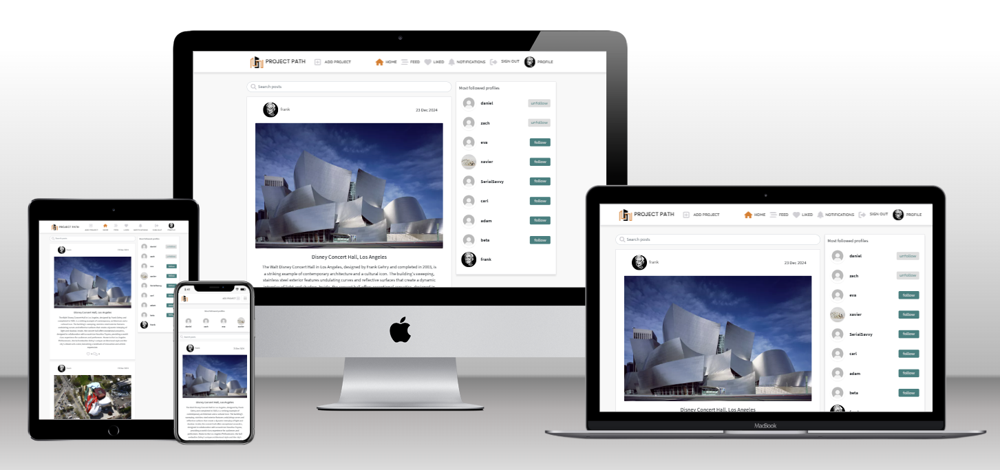
*Image was generated using this [techsini.com website](https://techsini.com/multi-mockup/index.php)

# Installation

### Prerequisites
- Python 3.8 or later
- Django 4.2 or later
- PostgreSQL or another supported database

### Prerequisites
- **Python 3.8** 
- **Node.js 16.19.1** for frontend development
- **npm 8.19.3** for managing frontend dependencies
- **Django 4.2** 
- **PostgreSQL** or another supported database
- **Git** for version control

### Steps to Set Up
- **Clone the Repository**
 ```bash```
  git clone https://github.com/houndhunger/django-restaurant-web-and-booking.git
  cd django-restaurant-web-and-booking

## Deployment

The **Project Path** application can be hosted on a web server to provide online access. It is designed for easy integration into websites or platforms, allowing users to share and showcase their portfolio projects seamlessly.

### Via Gitpod
1. Upon starting the Gitpod online workspace,
2. I initiated a Python web server using the command: ```"python3 manage.py runserver"```
3. Gitpod prompted me to open the website within its environment.
4. After making updates and saving them on Gitpod,
5. I refreshed the website to reflect the changes.

### Via Heroku
- The website repository is hosted at [Restaruant booking system repository](https://github.com/houndhunger/django-restaurant-web-and-booking/)
- The project is deployed to Heroku and is publicly accessible. [Restaruant booknig system app](https://django-restaurant-web-and-book-565ecd4fe61b.herokuapp.com/)

To deploy the project, follow these steps:

1. Ensure that you have configured your environment variables in the Heroku dashboard.
2. Push your code to the Heroku remote repository: ```"git push"```
3. Deploy the app on Heroku either by manually deploying through the Heroku dashboard or by enabling automatic deployment for the main branch.


## Deployment

The **Project Path** application can be hosted on a web server to provide online access. It is designed for easy integration into websites or platforms, allowing users to share and showcase their portfolio projects seamlessly.

### Via Gitpod

Start a **Gitpod** workspace by opening the project in Gitpod.

**For the frontend:**
   - Install Node.js version 16 using **nvm**:
     ```bash
     nvm install 16 && nvm use 16
     ```
   - Start the frontend development server using:
     ```bash
     npm start
     ```
3. Gitpod prompted me to open the website within its environment.
4. After making updates and saving them on Gitpod,
5. I refreshed the website to reflect the changes.

**For the backend:** 
1. Set up a Python web server for the backend using the command:
   ```bash
   python3 manage.py runserver
   ```
2. Gitpod prompted me to open the website within its environment.
3. After making updates and saving them on Gitpod,
4. I refreshed the website to reflect the changes.

!!! KEEP UPDATING
##  Features

- **Create & Edit Project Post**: Users can create and edit a project post, including essential details like title, description, title image & gallery.  
- **View Project Posts**: Users can browse through different project posts, view project details, and explore images uploaded by others.
- **Search for Projects & Users**: Users can search for projects by title, description or user name easily find content related to their interests.  
- **Like a Project Post**: Users can like a project post to show appreciation and support for the content.  
- **Comment on Project Post**: Users can leave comments on project posts to engage with others and provide feedback.  
- **Follow/Unfollow Users**: Users can follow other users to receive updates on their new project posts, and unfollow them when desired.  
- **Edit Profile**: Users can update their profile information such as name, user image and password.  
- **Authentication**: Users can sign up, sign in, and maintain their session.  
- **Password Management**: Users can update their passwords securely, with success or failure notifications displayed.  
- **Notifications System**: Users are notified about important activities such as project updates, comments, given likes to their project posts or when they are followed.

## Future Enhancements

- **Image Gallery for Projects**: Users can upload multiple images to a project post, offering a richer visual representation.
- **Email Notification**: Users will receive email notifications about key updates.
- **User Messages**: Users will be able to send and receive direct messages to communicate privately with others. This will foster more personal interactions and collaboration between users.
- **Project Revisions**: Users can track and manage different versions or revisions of their project posts, ensuring that all changes are logged and can be viewed by other users. This feature is helpful for users who make frequent updates to their projects.
- **Tagging Projects**: Users can tag their project posts with relevant keywords to help others find similar content.
- **Project Bookmarking**: Users will be able to bookmark projects they are interested in for easy access later.
- **Cross-platform Integration**: The platform will support integration with other project management tools and social media platforms to increase visibility and engagement for project posts.

## Structure

### React Components:
- **Navigation Bar**  
    The fully responsive navigation bar is present on all pages, providing links to Home, Menu, and other key sections like the user's Profile and Notifications. For signed-in users, the navigation bar also provides links to Create Post, Feed, Liked Posts, and Profile. The bar adapts based on whether a user is signed in or not, ensuring seamless navigation across devices.  
  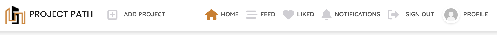  
  *Navigation bar on a large screen.*

  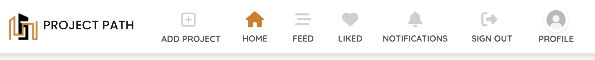  
  *Navigation bar for screens less than 1200px.*

  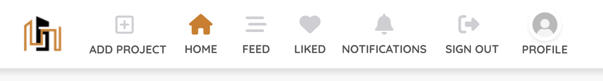  
  *Navigation bar for screens less than 992px.*

  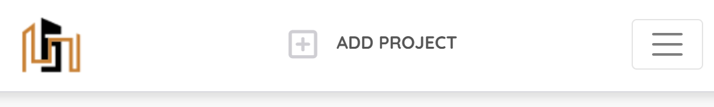  
  *Navigation bar for screens less than 768px.*

  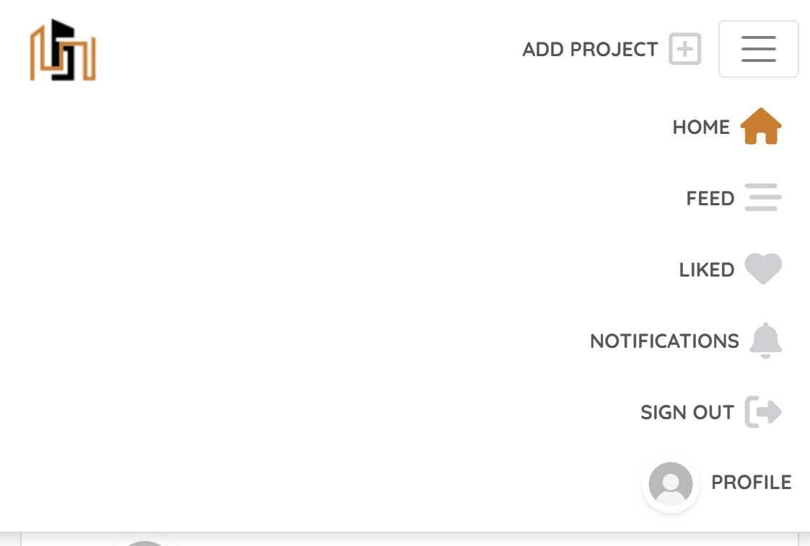  
  *Navigation bar with menu open for screens less than 768px.*

- **Most Followed - Popular Profiles**  
    This component displays a list of the most followed profiles, giving users easy access to popular or influential accounts within the platform.
    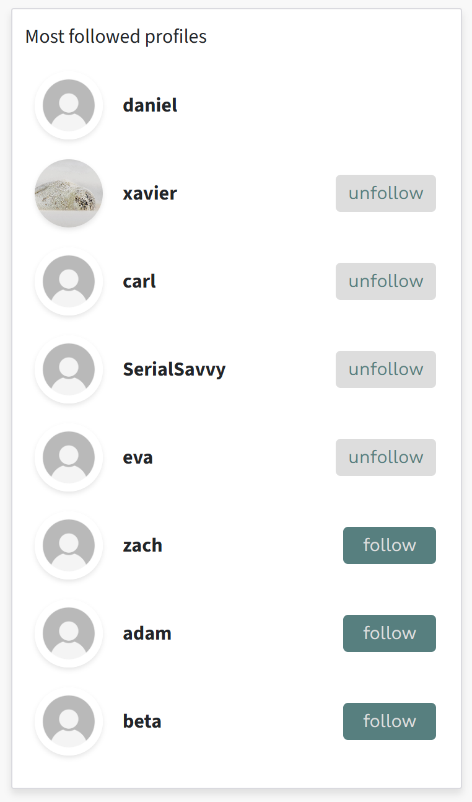

- **Search Bar**  
    The search bar, Displayed in Posts Pages, allows users to easily find content by searching for specific posts, users, or keywords. It is conveniently placed to ensure quick access to the desired content.
    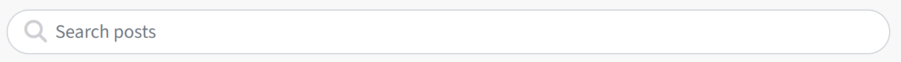

- **More Dropdown**  
    Available on the post pages, the "More Dropdown" provides users with options to edit or delete their own posts or comments. This functionality ensures that users have control over their content.
    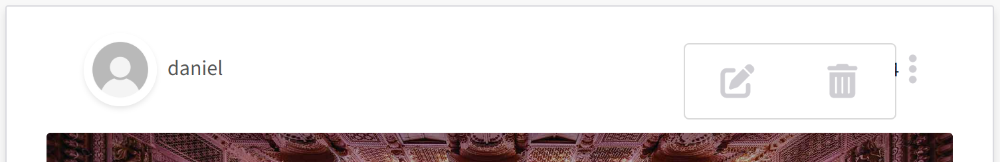

- **Asset**
    A reusable component for displaying a spinner, image, or message, typically used for loading states or asset display.
- **Avatar**
    A component for displaying a user's profile image, with customizable size and optional text.
    

### Pages:
- **Add Project**  
    A page dedicated to adding new posts or editing existing ones. Users can input title, description, add image, and make necessary changes to previously created content.
    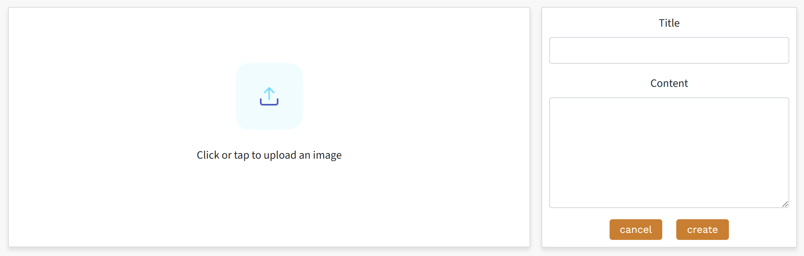

- **Post Page & Edit Form**  
    A dedicated page for viewing individual posts. Users can add or edit their posts, comment, like, and interact with the post content.
!!! ADD IMAGE here

- **Posts - Home, Feed, and Liked**  
    The **Home** page displays an overview of the most recent posts and serves as the main landing page for content discovery. The **Feed** page showcases posts from followed users in a dynamic feed, allowing users to see updates in real-time, interact with posts, and engage with the community. The **Liked** page provides a dedicated space for viewing all posts the user has liked, offering easy access to content they have shown interest in.
!!! ADD IMAGE here

- **Notifications**  
    A page that displays notifications about recent interactions such as new likes, comments on posts, and follow activity. It keeps users informed about important actions related to their account.
    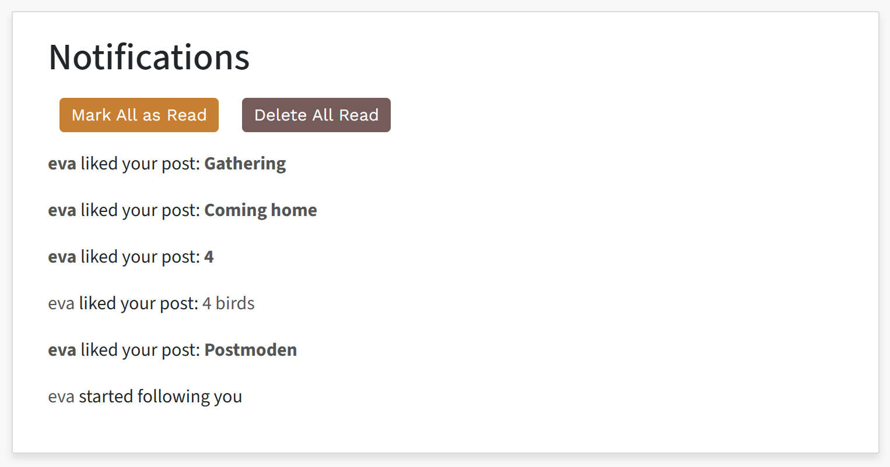

- **Profile Page & Edit Form, Change username, Chage password**  
    The profile page allows users to view and edit their information, including changing their username and updating their password. Furthermore shows sum count of own posts, followers, following, viewing and managing own posts.
    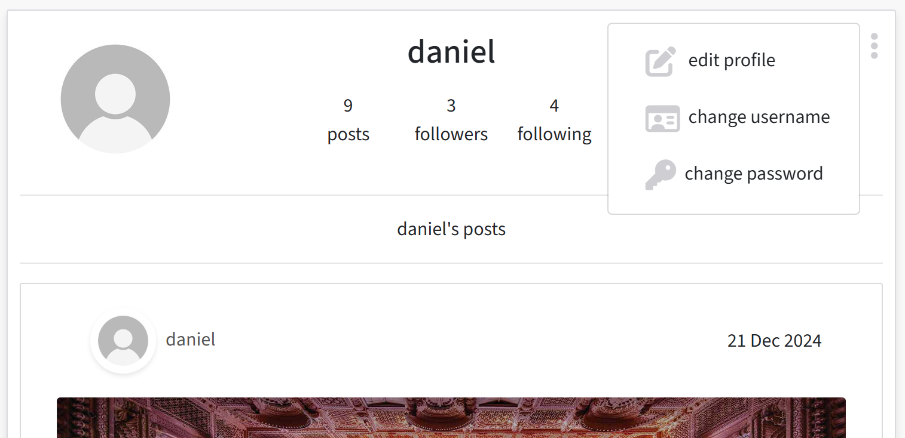  
    *The 'More' dropdown menu in the profile section.*

      
    *The page layout for editing a user's profile.*

      
    *The page layout for changing a user's username.*

      
    *The page layout for changing a user's password.*

- **SignIn & SiugUp Pages**  
    The Sign In and Sign Up pages allow users to authenticate their accounts by logging in or creating a new account. These pages facilitate seamless access to the platform's features, ensuring secure and efficient user onboarding.
    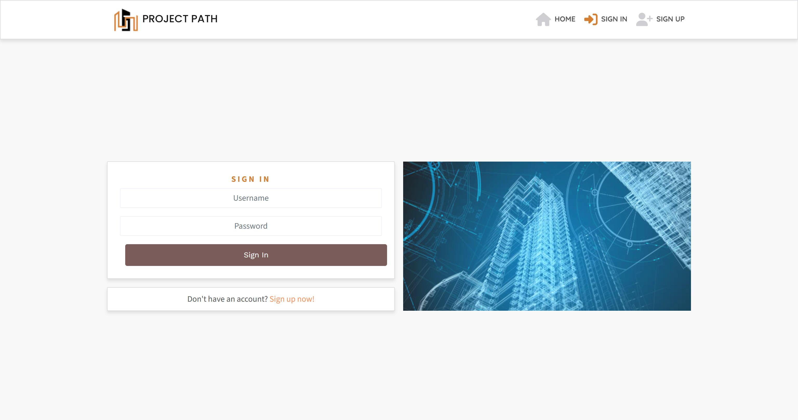
    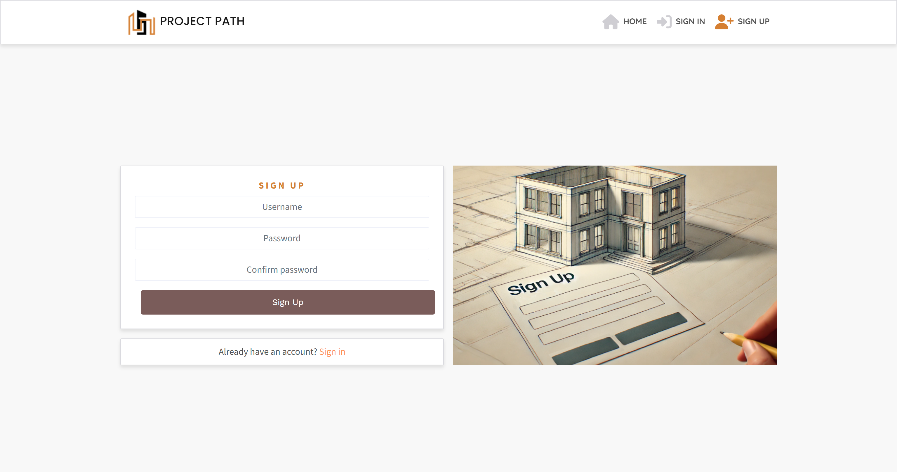

- **Not Found Page**  
    This page appears when a user navigates to a broken or unavailable link.
    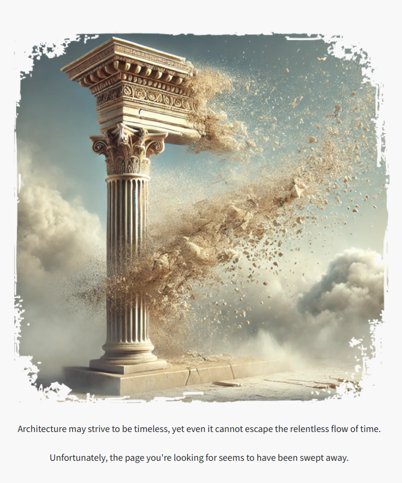

 ### Entity-Relationship Diagram (ERD)
  - The following ERD outlines the relationships between models in the system:
  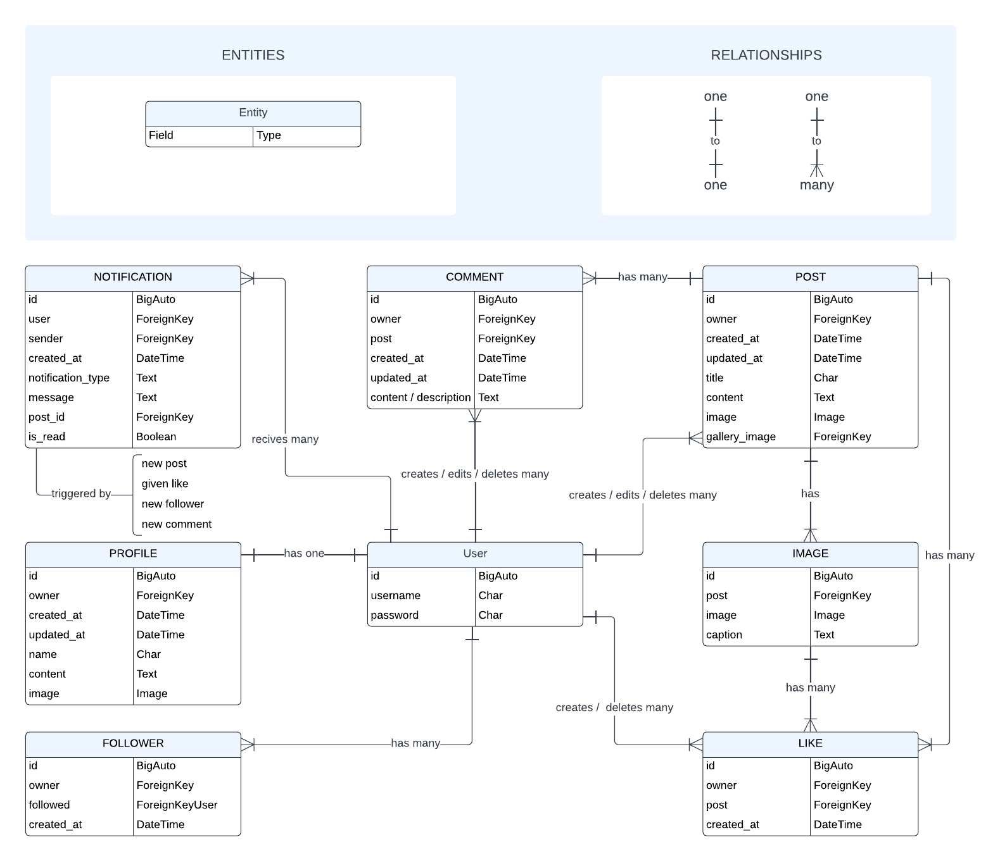

## Back-End

1. **Setup**: Initialized the project with Django REST Framework.
2. **Models, Views, Serializers**: Gradually developed resources for user profiles, posts, and comments.
3. **Post Like Feature**: Added functionality for liking posts (PostLike model, view, and serializer).
4. **Followers Feature**: Implemented a follow feature (Follow model, view, and serializer).
5. **Notifications**: Integrated notifications for likes and follows (Notification model and view).
6. **API Filtering**: Introduced API filtering for optimized querying.
7. **Database Setup**: Configured PostgreSQL for production and prepared settings for deployment.
8. **Deployment**: Deployed the app to Heroku with secure production settings.

## Front-End

1. **API Integration**: Connected the front-end with the back-end API using Axios for HTTP requests.
2. **Navigation Bar**: Built a responsive navigation bar (Sign In, Sign Up, Feed, and Profile).
3. **Post Creation**: Developed the Add Post page for posting user content.
4. **Post Details**: Created the PostPage component to display individual post details.
5. **Home Feed**: Built the Home Feed to display posts and the Liked Posts view.
6. **Profile Page**: Designed the Profile Page showing posts, followers, and following users.
7. **User Engagement**: Highlighted a "Most Followed Profiles" section for user engagement.
8. **User Interactions**: Integrated user interactions (like, comment, follow) with UI components.
9. **UI Enhancements**: Enhanced the UI for notifications and interaction prompts.
  

## User Stories  

- **As a user, I want to be able to navigate the site with ease:**  
  - **Problem:** Users need intuitive navigation to access different features across the site.  
  - **Action:** Implement a responsive navigation bar with links to Home, Feed, and Profile, as well as sign-in and sign-up options for unauthenticated users.  
  - **Outcome:** Users can easily navigate the site on any device. 

| | | |
| :- | :- | :-|
|  |  |  |
|  |  |  |

- **As a user, I want to register and sign in to access my account:**
  - **Problem:** Users need secure access to their personalized accounts.
  - **Action:** Implement sign-up and sign-in functionality with form validation.
  - **Outcome:** Users can securely register and sign in to their accounts.

| | | |
| :- | :- | :-|
| User clicks on SIGN UP in Navigation menu, which leads user to SIGN UP page | User fills name, password and confirmation password. Then clicks Sign Up button | User will be redirected SIGN IN page |
|  | 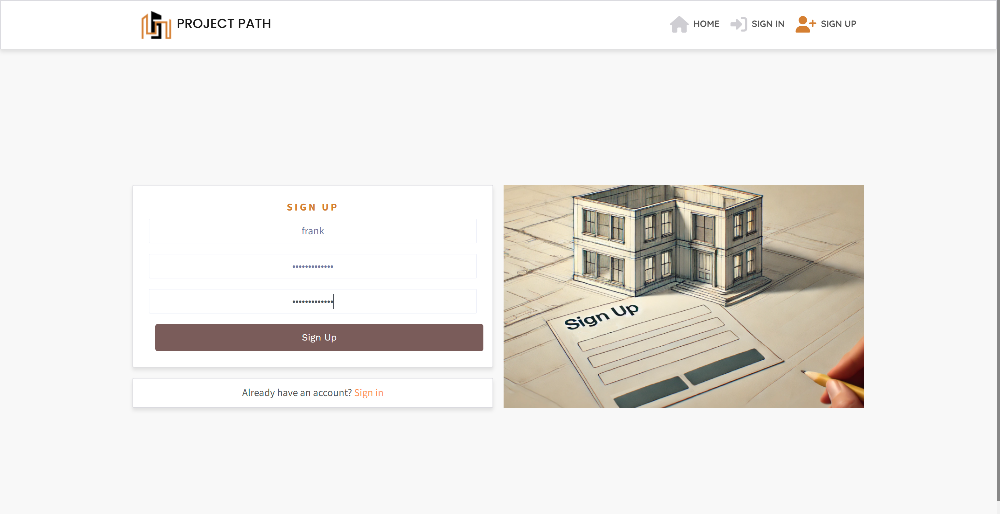 |  |
| User fills name and password. Then clicks Sign In button | User will be redirected to Home page |  |
| 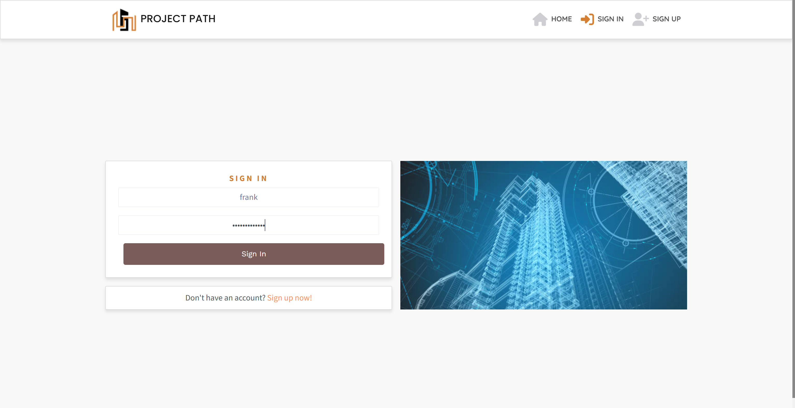 | 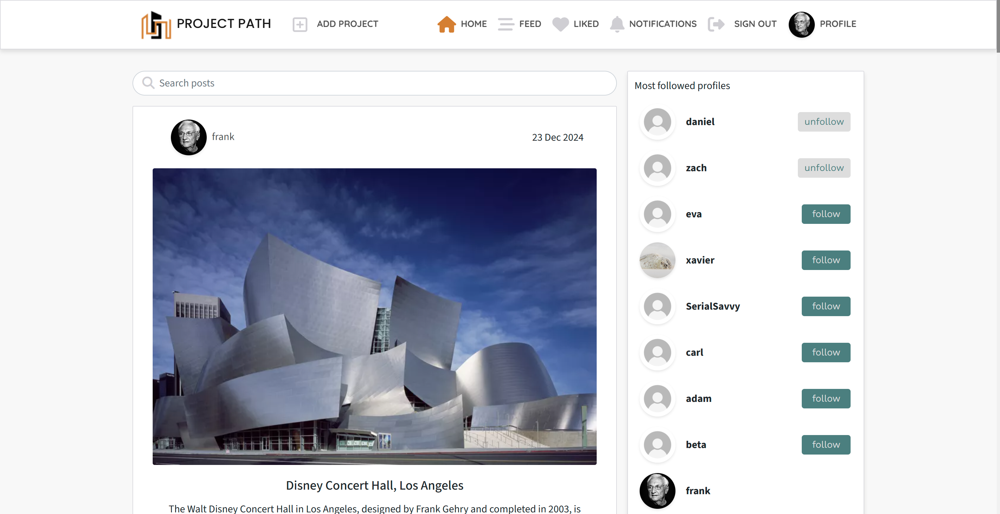 |  |

- **As a user, I want to add posts to share content:**
  - **Problem:** Users need a way to create posts that display on their profile and in feeds.
  - **Action:** Develop an "Add Post" component where users can create posts with text and images.
  - **Outcome:** Users can successfully create posts and share content.

| | | |
| :- | :- | :-|
| User clicks on ADD PROJECT in Navigation menu, which leads user to Project Post page | User loads image by clicking on upload icon | User fills Project Title and Project Description |
| 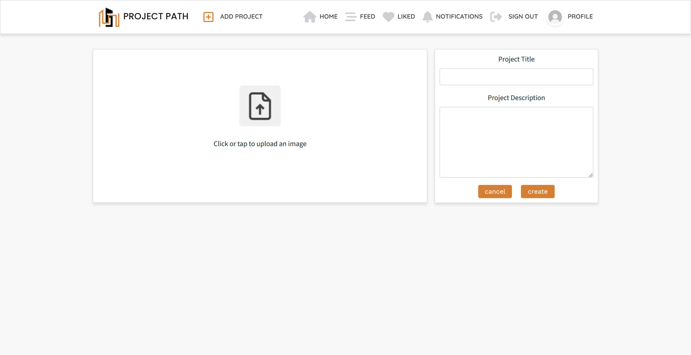 | 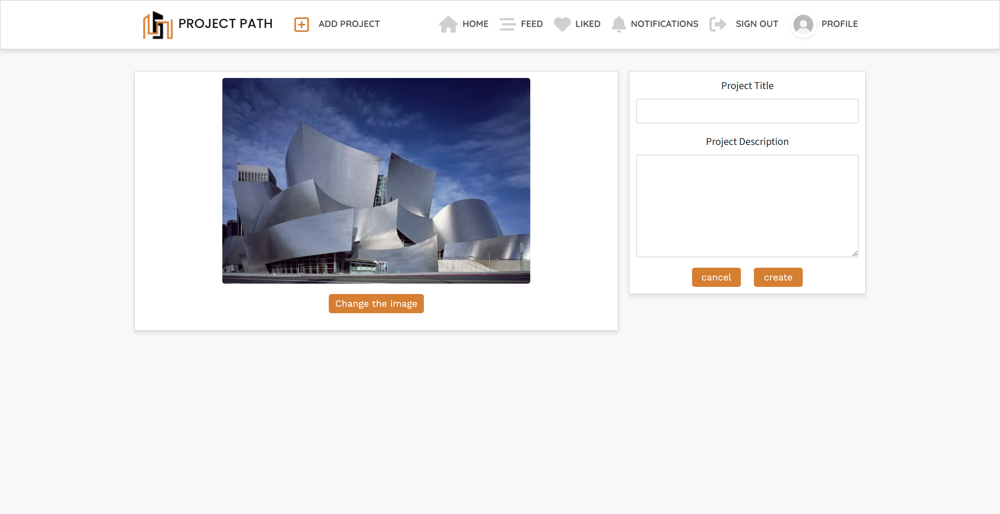 | 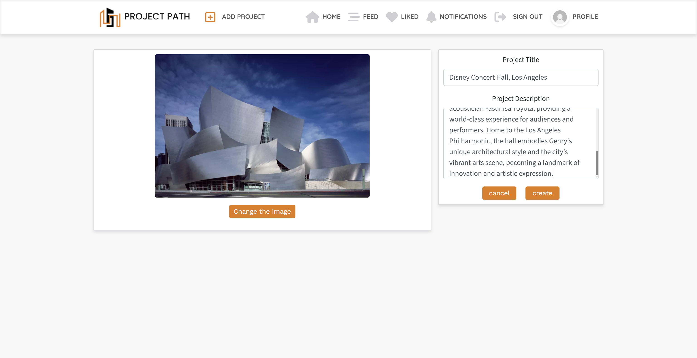 |
| User submits project by clicking create and is forwarded to Project Post which user just created  |  |  |
| 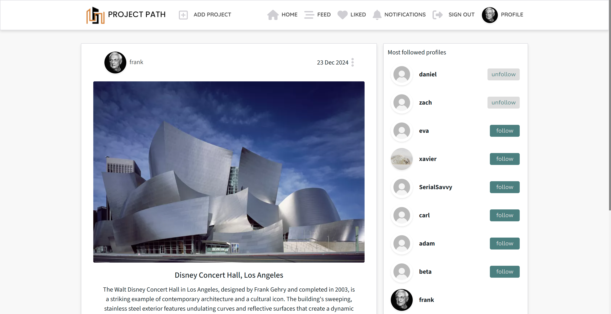 |  |  |

- **As a user, I want to edit or delete my content (post):**
  - **Problem:** Users need the ability to modify or remove their posts after they are created.
  - **Action:** Implement edit and delete functionality on each post to allow users to update or remove their content.
  - **Outcome:** Users can easily modify or delete their posts, ensuring content remains relevant and up to date.

| | | |
| :- | :- | :-|
| User from Project Post page clicks 3 dots to open More Dropdown offering Edit or Delete Project Post | By clicikng pencil icon user is forwarded to Project Post Edit page | Edit coresponding fields and submit Project Post with changes by clicking save button |
|  |  |  |

- **As a user, I want to view and manage my profile:**
  - **Problem:** Users need a centralized page to view and edit their personal information and posts.
  - **Action:** Create a Profile page displaying user details, posts, followers, and following lists.
  - **Outcome:** Users can manage their profiles and view their activity.

  | | | |
| :- | :- | :-|
|  |  |  |
|  |  |  |

- **As a user, I want to discover popular profiles:**
  - **Problem:** Users need a way to find inspiring content and connect with active users.
  - **Action:** Display a "Most Followed Profiles" section.
  - **Outcome:** Users can easily find and follow popular profiles.

- **As a user, I want to engage with posts through likes and comments:**  
  - **Problem:** Users need interactive features to show appreciation and provide feedback.  
  - **Action:** Add like and comment functionality to the Post Page and other feeds.  
  - **Outcome:** Users can interact with content effectively.  

- **As a user, I want to follow or unfollow profiles:**  
  - **Problem:** Users need a way to connect with or disconnect from other profiles.  
  - **Action:** Implement follow/unfollow functionality across the site.  
  - **Outcome:** Users can easily manage their connections. 

| | | |
| :- | :- | :-|
|  |  |  |
|  |  |  |
|  |  |  |
|  |  |  |
|  |  |  |
|  |  |  |

## Bugs and Issues

### Solved Bugs

- **Post Like Issue**

  - **Problem**: Likes were not correctly counted for posts after the first like, leading to inaccurate like counts.
  - **Solution**: Updated the like counting logic to handle multiple likes properly on the same post.

- **Follow Feature Bug**

  - **Problem**: Users were unable to unfollow others due to a database query error, which resulted in an unresponsive unfollow feature.
  - **Solution**: Corrected the database queries to resolve the unfollow action bug.

- **Profile Display Issue**

  - **Problem**: User profiles were not displaying accurate follower and following counts, causing inconsistencies in the profile view.
  - **Solution**: Fixed the data retrieval logic to ensure the correct number of followers and following were shown.

- **Responsive Layout Bug**

  - **Problem**: The site layout was not responsive on mobile devices, causing elements to overlap and become difficult to navigate.
  - **Solution**: Applied responsive design fixes to ensure that the layout adjusts properly across different screen sizes.

- **Image Loading Issue**

  - **Problem**: Profile images (and potentially other images later) were not loading correctly on certain pages, resulting in broken image links.
  - **Solution**: Fixed the image source URLs and optimized the loading process, using Cloudinary to ensure proper image display and efficient loading.

- **Form Validation Bug**

  - **Problem**: Front-end form validation was not triggering on some forms, causing submission errors.
  - **Solution**: Corrected the validation script to ensure proper triggering of front-end form validation before submission.

  - **Notification model was missing user reference**
  - **Problem**: Only the user ID was being sent, causing the frontend to lack the necessary user information to display notifications properly.
  - **Solution**: Sent the full user object in the notification model, allowing the frontend to display notifications with the correct user details.

  - **Post Submission Redirection Issue**
  - **Problem**: When a user submits a post or changes their password, the action is processed and updated, but the user is not redirected afterward.
  - **Solution**: The issue originated in the backend, where the `signals.py` file for notifications incorrectly called the `user` instead of the `owner`.

### Unsolved Bugs

- **Admin Styling Issue on Heroku Deployment**
  - **Problem**: Static files, including CSS for the admin panel, were not being applied correctly after deploying the application to Heroku, causing the admin interface to appear unstyled.
  - **Solution**: Pending investigation and update to ensure static files are properly configured and served on Heroku for correct styling in the admin panel.

## Testing

### Code validation

**Front end**

- **CSS**: The following file has been validated and no errors were found when passing through the [Jigsaw validator](https://jigsaw.w3.org/css-validator/).

- **JavaScript - JSX**: The following file has been validated and no errors were found when passing through the [ESLint](https://eslint.org/).
  - [static/js/flatpickr.js](https://django-restaurant-web-and-book-565ecd4fe61b.herokuapp.com/static/js/flatpickr.js)
  - JavaScript follows the ES6+ standards with ESLint configuration enabled for the project.
  **Back end**
- **Python**: Code passes [pep8ci](https://pep8ci.herokuapp.com/)and [pylint](https://pypi.org/project/pylint/) validation with 100% success. Validated are following
  - **files:** admin.py, apps.py, models.py, serializers.py, serialziers.py, signals.py, urls.py, views.py
  - **folders:** followers, likes, notifications, posts, profiles

!!! Fill tables with images and text

### Test Cases

#### Manual Testing

Here are the key manual tests performed on using project path web:

1. **Add a Project**

   - **Test:** Create a new project with valid data.
   - **Expected Result:** Project is added and visible in the project list.
   - **Steps:**
     1. Fill in project name and description.
     2. Click "Add Project".
     3. Verify that the new project appears in the list.

2. **Edit a Project**

   - **Test:** Edit an existing project.
   - **Expected Result:** Project details are updated successfully.
   - **Steps:**
     1. Click "Edit" on an existing project.
     2. Change the project name or description.
     3. Click "Save".
     4. Verify the project details have been updated.

3. **Delete a Project**

   - **Test:** Delete a project.
   - **Expected Result:** Project is removed from the project list.
   - **Steps:**
     1. Click "Delete" on a project.
     2. Confirm deletion.
     3. Verify the project is no longer visible.

4. **Post a Comment**

   - **Test:** Add a comment to a project.
   - **Expected Result:** Comment appears under the project.
   - **Steps:**
     1. Navigate to a project.
     2. Enter a comment in the comment box.
     3. Click "Post Comment".
     4. Verify the comment appears under the project.

5. **Edit a Comment**

   - **Test:** Edit an existing comment.
   - **Expected Result:** Comment is updated successfully.
   - **Steps:**
     1. Hover over an existing comment.
     2. Click "Edit".
     3. Modify the text and save.
     4. Verify the comment is updated.

6. **Delete a Comment**

   - **Test:** Remove a comment from a project.
   - **Expected Result:** Comment is removed.
   - **Steps:**
     1. Hover over a comment.
     2. Click "Delete".
     3. Confirm deletion.
     4. Verify the comment is no longer visible.

7. **Give and Remove Like**

   - **Test:** Like and unlike a project or comment.
   - **Expected Result:** Like is toggled on and off successfully.
   - **Steps:**
     1. Click "Like" on a project or comment.
     2. Verify the like count increases.
     3. Click "Unlike" to remove the like.
     4. Verify the like count decreases.

8. **Follow and Unfollow a User**

   - **Test:** Follow and unfollow a user.
   - **Expected Result:** User's follow status is toggled successfully.
   - **Steps:**
     1. Click "Follow" on a user's profile.
     2. Verify the follow count increases.
     3. Click "Unfollow" to remove the follow.
     4. Verify the follow count decreases.

9. **View Notifications**

   - **Test:** View new and unread notifications.
   - **Expected Result:** Notifications are listed and correctly marked as unread.
   - **Steps:**
     1. Navigate to the notifications page.
     2. Verify unread notifications are listed at the top.
     3. Verify read notifications are marked as read.

10. **Read and Unread Notifications**

    - **Test:** Mark notifications as read or unread.
    - **Expected Result:** Notifications can be toggled between read/unread states.
    - **Steps:**
      1. Click on a notification to mark it as read.
      2. Verify the notification is marked as read.
      3. Click on a read notification to mark it as unread.
      4. Verify the notification is marked as unread.

11. **Delete Notifications**

    - **Test:** Delete a notification.
    - **Expected Result:** Notification is removed from the list.
    - **Steps:**
      1. Click "Delete" on a notification.
      2. Confirm deletion.
      3. Verify the notification is no longer listed.

12. **Log-in - Existing User and Log-out**

    - **Test:** Log in and log out with an existing user.
    - **Expected Result:** User can log in and out successfully.
    - **Steps:**
      1. Enter valid login credentials.
      2. Click "Log In".
      3. Verify redirection to the dashboard.
      4. Click "Log Out".
      5. Verify successful logout and redirection to the login page.

13. **Sign-in - New User**

    - **Test:** Register a new user.
    - **Expected Result:** User is created and redirected to the dashboard.
    - **Steps:**
      1. Fill in registration form with valid details.
      2. Click "Sign Up".
      3. Verify user is redirected to the dashboard.

14. **View and Edit Profile**

    - **Test:** View and edit user profile.
    - **Expected Result:** User profile can be viewed and edited successfully.
    - **Steps:**
      1. Navigate to the profile page.
      2. Edit the profile details (e.g., name, bio).
      3. Click "Save Changes".
      4. Verify the updated details appear on the profile.

15. **Change Username**

    - **Test:** Change the username.
    - **Expected Result:** Username is updated successfully.
    - **Steps:**
      1. Navigate to the profile edit page.
      2. Change the username.
      3. Click "Save Changes".
      4. Verify the username is updated on the profile.

16. **Change Password**
    - **Test:** Change the user password.
    - **Expected Result:** Password is updated successfully.
    - **Steps:**
      1. Navigate to the password change page.
      2. Enter the current password, new password, and confirm new password.
      3. Click "Change Password".
      4. Verify successful password update.

| | | | |
| :- | :- | :- | :- |
| 1. Log in to the system. | 2. Navigate to "Make a Reservation". | 3. Fill in reservation details (date & time, guest count, note, preferences). | 4. Submit and check if the reservation is successfully saved. |
|  |  |  |       |

## Credits

- **Mentor**: Thanks to my mentor for his guidance and support throughout the development of this project.
- **Code Institute Tutor Service**: Special thanks to the Code Institute Tutor Service for their assistance in difficult times and valuable feedback.
- **ChatGPT Service**: Appreciation to ChatGPT for providing helpful advice and code suggestions during the project development.
- **Family**: A heartfelt thank you to my wife, who lovingly took on all the household responsibilities, allowing me the time and focus to work on this project. Her constant support and understanding made this possible.

## License

This project is open-source and available under the MIT License. Feel free to fork, modify, and distribute the code for educational or commercial purposes.

---

Happy coding!
